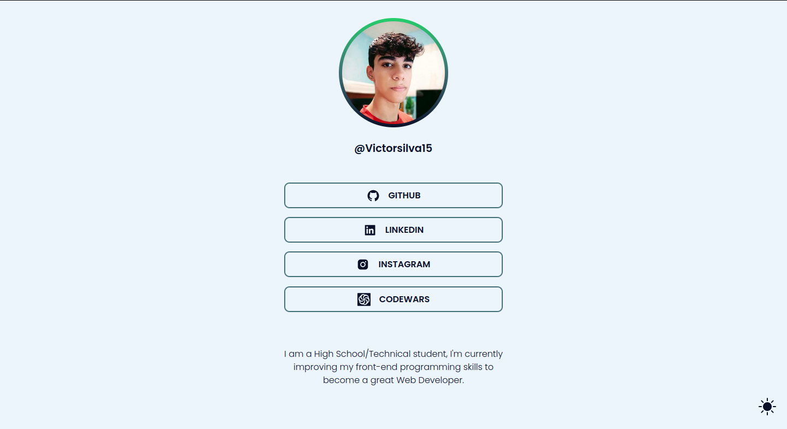

# Rocketseat Challenges

This repository will store all rocketseat challenges from discover plataform. Here you will find projects that use HTML CSS and JavaScript languages. if you want, you can clone the code with `git` and see the source code to try too. Below there're the links to the sub-repositories with the source code of each project:

- [Portfolio - HTML5 & CSS3](https://github.com/VictorSilva15/challenges/tree/main/portfolio) #1

- [Social Tree - ReactJS; Styled-Components; AOS and SWR](https://github.com/VictorSilva15/rocketseat-challenges/tree/main/social_tree) #2

