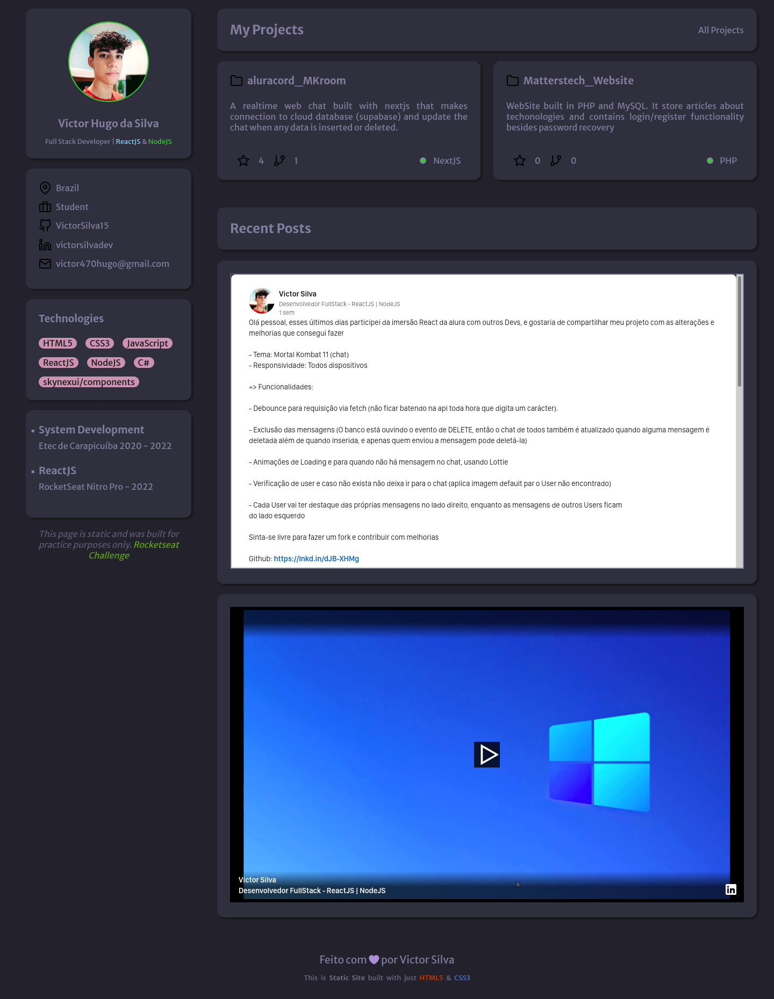

# Portfolio - Rocketseat challenge #1

Hello guy, this is a sub repository that keeps the source code of the first challenge from rocketseat plataform. Here I built my static portfolio using HTML5 and CSS3 only. I deployed it in vercel, so if you want to access the page click [here](https://victorsilvadev-portfolio.vercel.app/)

## Preview

---

## Status

🚧 Developing... 🚧

## Future Features

- Resposiveness
- API

## Features used

- HTML5
- CSS3
- Google Fonts
- vscode

---

### Official instruction documentation

[RocketSeat Notion](https://efficient-sloth-d85.notion.site/Desafio-Portfolio-1d3db21e654941f5872aece5fcc6bcc6#48a971a8fda44a678612ae689c786740)
